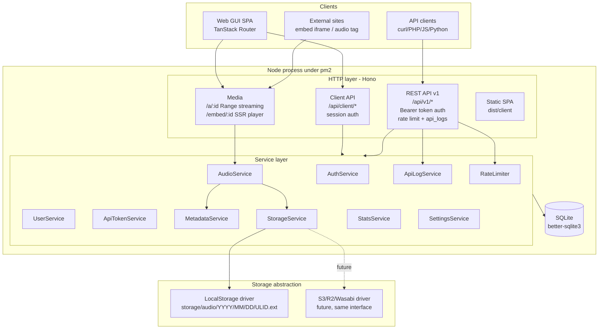

# Architecture Overview — Audio Hosting & Delivery Platform

## 1. Stack & Rationale

| Layer | Choice | Why |
| --- | --- | --- |
| Runtime | Node.js ≥ 20 (single process) | pm2-friendly: one `node dist/server/index.js` |
| HTTP framework | Hono + `@hono/node-server` | Tiny, TS-native, middleware composition for auth/rate-limit/logging; runs natively under pm2 |
| Frontend | TanStack Router (SPA) + TanStack Query + React 19 | Type-safe routing/loaders; SPA is served as static assets by the same Node process |
| Styling | Tailwind CSS v4 | Clean, modern, minimal UI without component-framework lock-in |
| Database | SQLite via better-sqlite3 + Drizzle ORM | Zero-ops single file (VPS friendly), WAL mode; typed queries; swap to Postgres later is a driver change |
| Audio metadata | `music-metadata` (pure JS) | Parses MP3/WAV/M4A/AAC/OGG/FLAC: duration, bitrate, sample rate, channels, container, codec, tags. No ffmpeg dependency |
| Magic-byte sniffing | Custom header checks (authoritative: `music-metadata` parse) | Never trust extension or client MIME |
| Build | Vite (client) + esbuild (server bundle) | `npm run build` → `dist/client` + `dist/server/index.js` |
| Process manager | pm2 (`ecosystem.config.cjs`) | `pm2 start ecosystem.config.cjs` |

Rejected alternative: **laju.dev (Laju Go)** — a Go Fiber + Inertia boilerplate; wrong fit because the deployment target is pm2 (a Node process manager), it requires a Go toolchain, and its sqlc/Inertia conventions don't reduce work for this brief.

## 2. High-Level Component Diagram



## 3. Request Flows

### Upload (GUI or API — same pipeline)

```
file (buffer) → validate size (413) → validate magic bytes (422 INVALID_FILE_TYPE)
→ quota check (422 STORAGE_LIMIT_EXCEEDED) → StorageService.put(ULID.ext)
→ AudioService: insert record → MetadataService.parse(stored bytes)
→ UPDATE record (duration/bitrate/sample_rate/channels/format/codec/tags-title)
→ respond { id, url, embed_url, ... }
```

Metadata extraction via `music-metadata` is in-process and takes milliseconds for typical audio files, so MVP runs it synchronously in the request. It is isolated behind `MetadataService` + a `status` column (`ready|pending`) so a queue (BullMQ/post-job) can be inserted later without touching routes: the service call would become a job enqueue and the worker would call the same `applyMetadata()`.

### Playback

```
GET /a/:id → ULID lookup → visibility check → stat() file
→ Range parse → 200 (full) / 206 (partial) stream from StorageService.open()
→ access log (async, never blocks stream)
```

Storage files live **outside** the web root and are never served statically; the only path to bytes is this authorized route. Original filenames are never used on disk.

## 4. Module Boundaries (per brief §25)

- `src/server/services/*` — business logic, zero Hono types. Controllers stay thin.
- `src/server/storage/` — `StorageDriver` interface (`put/open/stat/delete/urlFor`); factory resolves `STORAGE_DRIVER` env (`local` now, `s3` later). Records persist `storage_disk` + `storage_path` so rows written under one driver remain readable after migration.
- `src/server/routes/api-v1.ts` — public REST contract (Bearer). `routes/client*.ts` — internal JSON API for the SPA (session cookie). No logic duplication: both call the same services.
- `src/shared/` — DTO types + error codes, imported by both server and web.

## 5. Deployment Topology

Single app process (`dist/server/index.js`) + SQLite + local disk behind any reverse proxy (nginx/Caddy) with TLS. No Redis, no worker needed for MVP. `docker-compose.yml` provided; native pm2 deploy equally supported (see README §Deployment).

## 6. Extension Points Already Modeled

| Future feature (Phase 3) | Where it plugs in |
| --- | --- |
| S3/R2/Wasabi/MinIO | New `StorageDriver` implementation; `storage_disk` column already stored |
| Private audio / signed URLs | `audio_files.visibility` enum (`public|private`) + token check branch in `/a/:id`; expiry columns reserved in `api_tokens` |
| Chunked/resumable upload | `AudioService.createPending()` already separates record creation from finalize; add upload-session table + PUT chunks |
| Webhooks | Service layer owns mutations → emit `audio.uploaded`/`audio.deleted` from `AudioService` only |
| Queue for metadata | `applyMetadata()` is idempotent, callable from a worker |
| Postgres | Replace better-sqlite3 driver in `src/server/db` |
