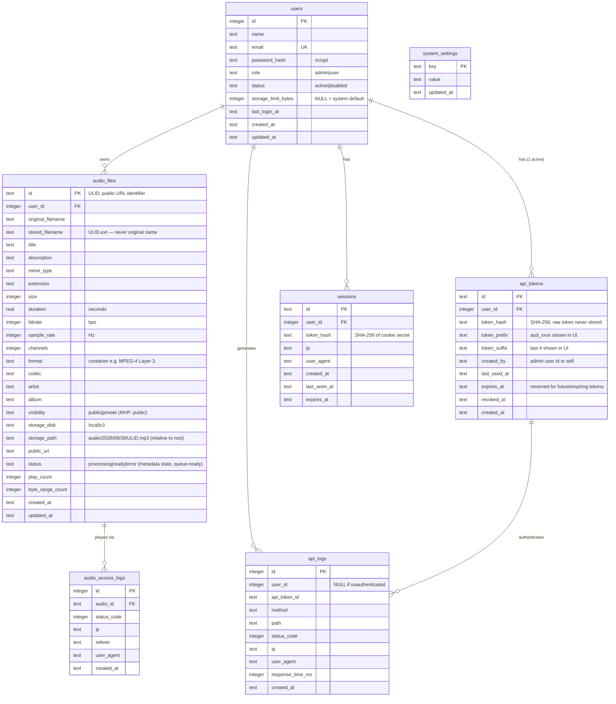

# Database Schema / ERD

Engine: SQLite (WAL). Timestamps: ISO-8601 UTC strings, set by application code. Primary keys: ULID (26-char, Crockford base32, URL-safe, sortable) for `audio_files`/`api_tokens`/`sessions`; INTEGER autoincrement for users/logs.

## ERD

## Indexes

- `audio_files(user_id, created_at)` — per-user listing/sort
- `audio_files(visibility)`, `audio_files(status)`
- `api_tokens(user_id) WHERE revoked_at IS NULL` — **partial unique: at most one active token per user**; history preserved for revoke/regenerate audit
- `api_logs(created_at)`, `api_logs(user_id)`, `api_logs(status_code)`
- `audio_access_logs(audio_id, created_at)`
- `sessions(expires_at)`, `sessions(token_hash)`

## Settings keys (`system_settings`, env provides defaults on first boot)

| key | default (env) | purpose |
| --- | --- | --- |
| `api_rate_limit_per_minute` | `API_RATE_LIMIT` (100) | requests/min per API token |
| `upload_rate_limit_per_minute` | `UPLOAD_RATE_LIMIT` (10) | uploads/min per API token |
| `max_upload_size_mb` | `MAX_UPLOAD_SIZE_MB` (100) | per-file cap |
| `default_user_storage_limit_mb` | `USER_STORAGE_LIMIT_MB` (1024) | quota for users without explicit limit |
| `cors_allowed_origins` | `CORS_ALLOWED_ORIGINS` | comma-separated origins; empty = same-origin only, NEVER wildcard by default |

## Deletion semantics

- User delete (admin): cascade — stored bytes removed via StorageService, rows removed; `api_logs` retained with `user_id` kept for audit (integrity PRAGMA off for controlled manual cascade in service code).
- Audio delete: remove row, remove stored object, remove its access logs.
