# Panduan Pengguna — Audio Hosting Platform

Versi bergambar (PDF): [user-guide.pdf](./user-guide.pdf)

## Masuk (Login)

Buka alamat aplikasi di browser, misalnya http://localhost:3000. Kalau belum masuk, halaman utama tetap bisa dipakai untuk mendengarkan — sidebar hanya muncul setelah login.
Klik Sign in, isi Email dan Password yang diberikan administrator, lalu tekan Sign in. Kalau gagal, pesan kesalahan merah muncul di bawah tombol.

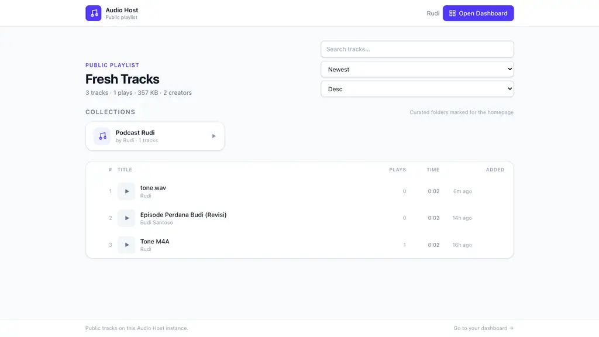

## Halaman Utama — Playlist Publik

Halaman / menampilkan semua audio yang ditandai Public dari semua akun — tanpa perlu login. Ada statistik (jumlah track, total diputar, ukuran, jumlah kreator), kolom pencarian, dan urutan (Terbaru / Paling diputar / Durasi / Judul).
Klik baris track untuk memutar: player lengket muncul di bawah (tombol sebelumnya / berhenti / berikutnya). Tombol tautan menyalin URL publik, tombol unduh mengunduh file.
Bagian Collections di atas daftar memuat folder-folder yang ditandai tampil di halaman utama. Klik kartu folder untuk membuka isi track publik di dalamnya.

## Dashboard Pribadi

Setelah login, buka Dashboard lewat sidebar atau tombol Open Dashboard. Kartu atas menunjukkan Total Audio, Storage Used, Uploads Today, Plays Today, dan API Requests Today milik sendiri.
Kolom Your Tracks hanya berisi file yang kamu unggah (bukan milik orang lain), lengkap dengan pencarian. Kolom Recent Activity mencatat upload, pemutaran, dan panggilan API terakhirmu.

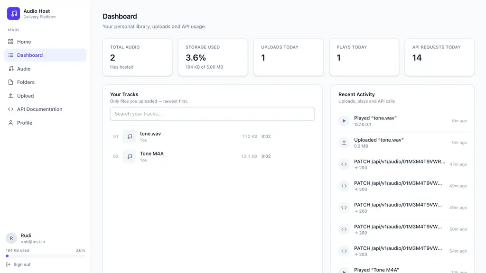

## Mengunggah Audio

Buka halaman Upload. Seret file ke area putus-putus atau klik untuk memilih (bisa banyak file sekaligus, antrean berjalan berurutan dengan progress persen).
Isi Title (berlaku khusus kalau hanya satu file), Description, Visibility (Public bisa didengar siapa pun yang punya URL; Private hanya lewat API terautentikasi), dan Folder tujuan (opsional).
Selesai upload, kartu hasil menampilkan player, URL publik + tombol Copy URL, tombol Copy Embed, dan tautan Manage. File yang melebihi sisa kuota ditolak sebelum diunggah; file PHP yang diganti ekstensi .mp3 ditolak dengan INVALID_FILE_TYPE.

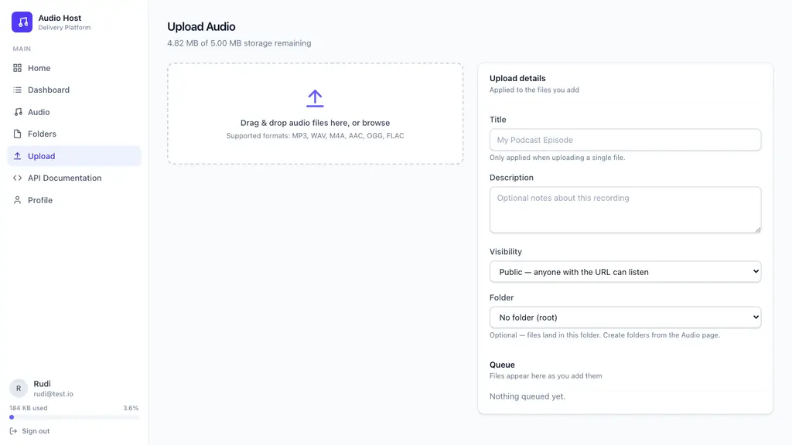

## Folder Virtual

Folder bersifat virtual (satu level, tanpa sub-folder): file fisik tidak pindah, hanya penanda di database. Buka halaman Folders lalu New Folder: isi nama (unik per akun), Visibility, dan centang Show on public homepage bila ingin tampil di halaman utama (syaratnya visibility Public).
Memasukkan file ke folder bisa lewat dropdown Folder saat upload, lewat filter di halaman Audio, atau lewat form Edit di detail audio. Menghapus folder memberi pilihan: isi kembali ke root, atau hapus permanen beserta track di dalamnya.
Badge folder muncul di tabel Audio; halaman Audio bisa memfilter All folders / No folder / per folder.

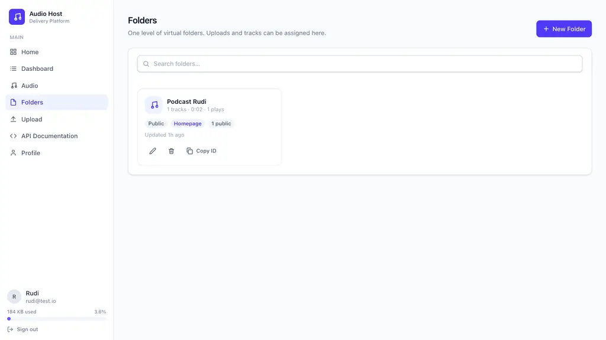

## Mengelola Koleksi Audio

Halaman Audio memuat semua file milikmu: cari berdasar judul/nama file/deskripsi, saring format dan folder, urutkan berdasar tanggal/judul/ukuran/durasi/jumlah diputar.
Tombol Play memutar langsung; Details & embed membuka metadata lengkap (MIME, container, codec, bitrate, sample rate, channels, durasi, ukuran, ID), statistik pemutaran (total, hari ini, 7 hari, terakhir diputar, pengunjung unik), form Edit (judul/deskripsi/visibility/folder), serta kode embed <audio> dan <iframe> siap salin plus pratinjau live.
Hapus selalu lewat dialog konfirmasi dan menghapus file fisik + baris database + log aksesnya.

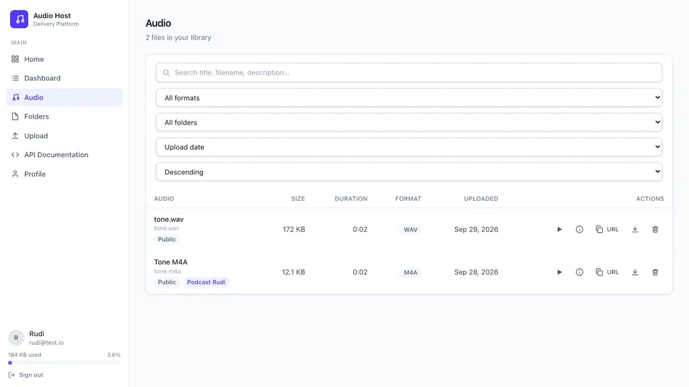

## Dokumentasi API & Profil

Halaman API Documentation menjelaskan Base URL /api/v1, header Authorization: Bearer aud_..., semua endpoint (me, upload, list, detail, patch, delete), format respons sukses/gagal, tabel kode error, contoh cURL / JavaScript / PHP / Python, cara embed, rate limit, dan CORS.
Halaman Profile menampilkan data akun, pemakaian storage, token API tersamar (regenerate menampilkan token penuh SEKALI — salin saat itu juga), dan ganti password (otomatis mengeluarkan semua sesi).

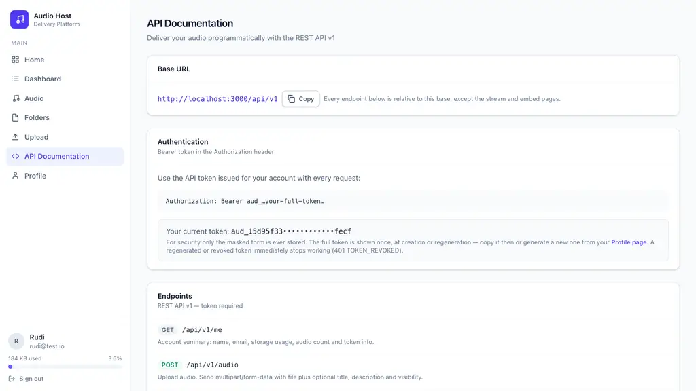

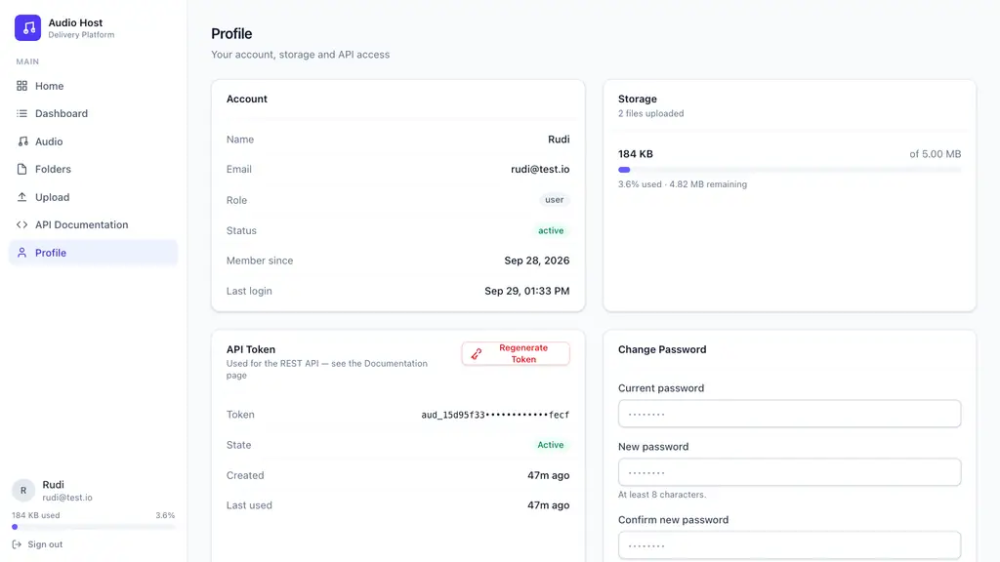

## Administrator: Dashboard & Users

Admin Dashboard menampilkan Total Users, Total Audio, Total Storage, Uploads Today, API Requests Today (+ jumlah error), konsumen storage terbesar, dan upload terbaru lintas akun.
Halaman Users: cari nama/email, buat user baru (token penuh tampil sekali), buka detail (edit data, reset password, regenerate/revoke token, daftar audio user itu, hapus user beserta seluruh file-nya), nonaktifkan/aktifkan akun.

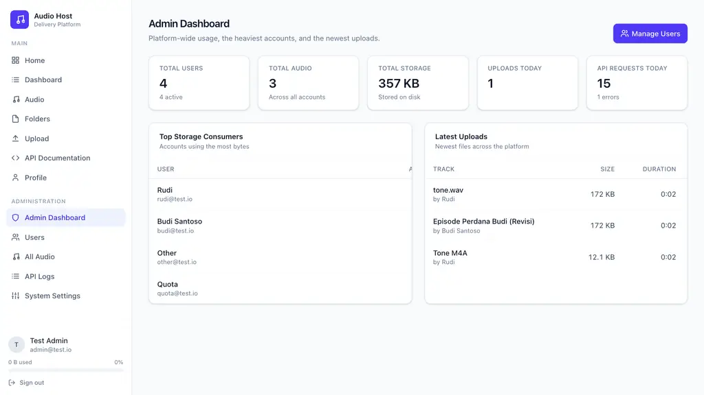

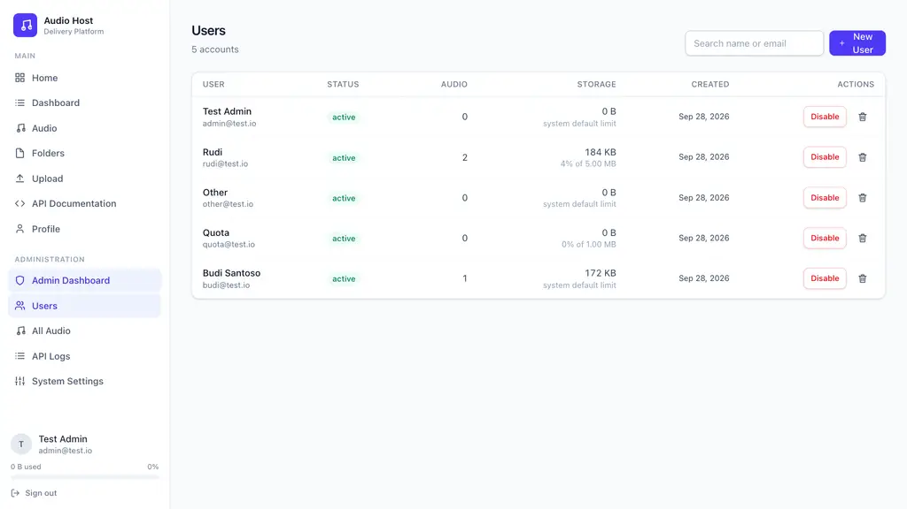

## Administrator: Audio, Log & Pengaturan

All Audio: semua file semua akun dengan filter pemilik/format/pencarian; putar, salin URL/embed, unduh, hapus.
API Logs: setiap request /api/v1 tercatat (user, method, path, status, waktu respons, IP, user-agent) dengan filter user/status/path/tanggal.
System Settings: batas rate API & upload, ukuran file maksimum, kuota default user, daftar origin CORS, dan APP_URL — berlaku langsung tanpa restart.

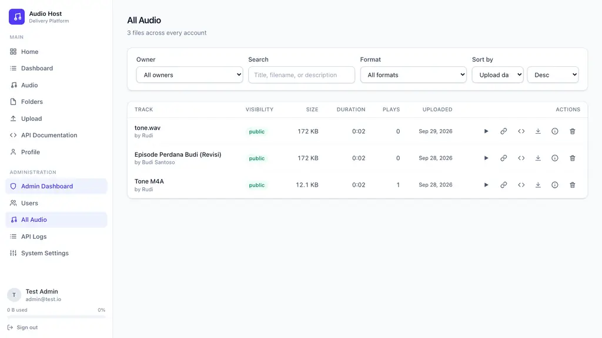

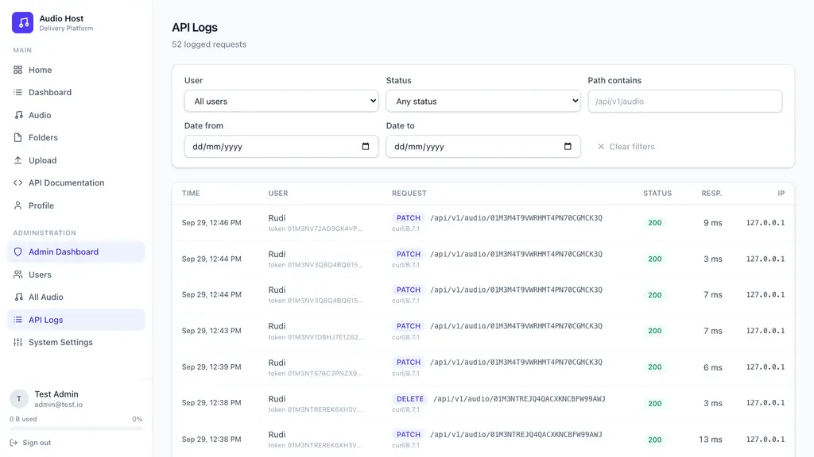

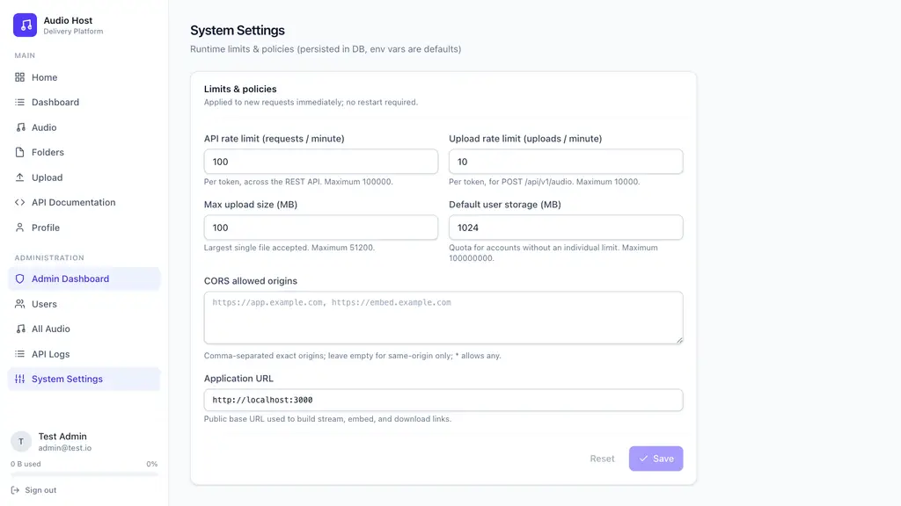
